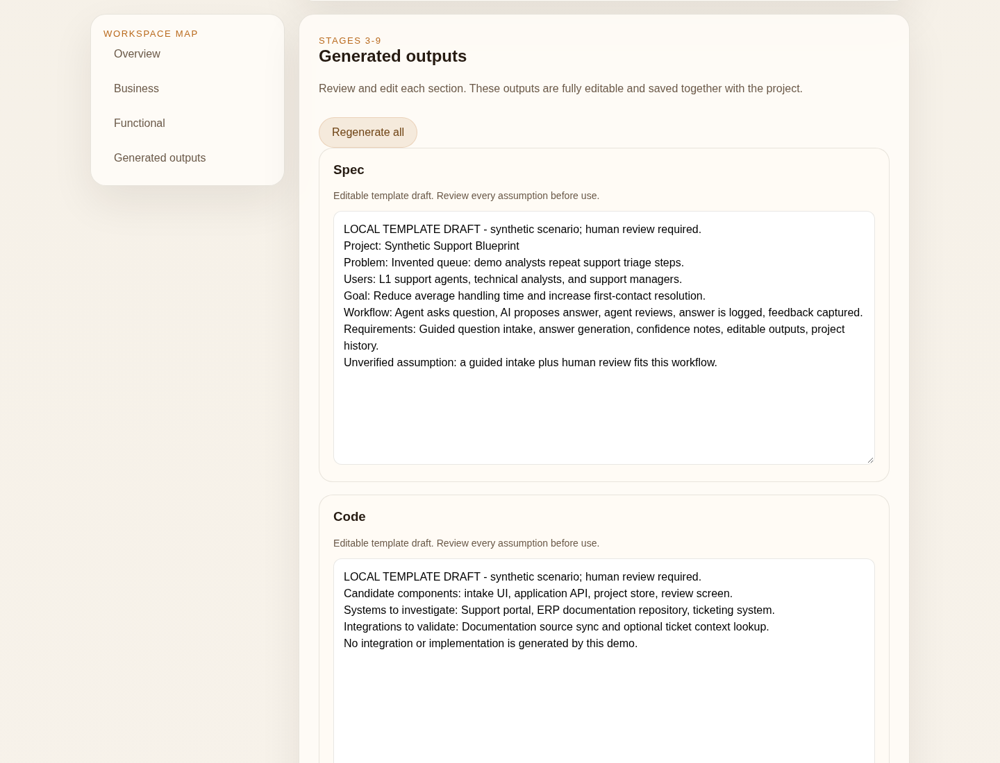

# AI Solution Builder

A local presales workspace for turning business and functional inputs into editable solution drafts. It demonstrates a structured discovery-to-blueprint flow, not an autonomous architect or a production service.

**This curated release is an MVP with no authentication or billing. It runs a deterministic local template, not an AI model. Use synthetic data only and keep the server on loopback.** The project name comes from the original AI-assisted workspace; the remote model adapters are intentionally not included here.



## Problem and workflow

Presales discovery often spreads across notes, requirements and technical sketches. This workspace keeps that context together:

1. Create a project and describe its business problem.
2. Capture users, goals, proposed metrics, constraints and budget assumptions.
3. Record workflows, systems, requirements, data sources and risks.
4. Save and generate nine editable draft sections: specification, code approach, security, tests, production planning, measurement, improvements, maturity and agile mapping.
5. Review, edit and save the draft. Inputs and outputs survive a reload in local SQLite.

"Production" is a planning section, not a statement that this software is ready for production. Suggested metrics are inputs, not measured improvements. No time-saving, quality or business-impact result is claimed.

## Run locally

Requires Node.js **22.23 or newer** and npm. The included version uses Node's native `node:sqlite`; Node may print an experimental-feature warning.

```bash
npm ci
npm run db:init
npm run db:seed
npm run dev
```

Open `http://127.0.0.1:3000`, select **Synthetic Support Blueprint**, then choose **Generate solution**. No key, cloud account or external endpoint is needed. The seed scenario is invented and starts without generated outputs. The seed command skips an existing database; to reset, stop the app and remove the local `data/` directory before seeding again.

For a built local run:

```bash
npm run build
npm start
```

Both server commands bind to `127.0.0.1`. A local build is not a production-readiness certification. Do not expose the app to the network or deploy it as a shared service.

## Architecture

- Next.js App Router and React for project creation and the guided editor.
- TypeScript types and input validation shared with route handlers.
- Native SQLite with parameterized SQL for the project store.
- A no-network template adapter that copies selected inputs into explicit draft sections. It does not reason over requirements, retrieve sources or verify feasibility.
- No Prisma runtime, external provider, telemetry integration or deployment unit is part of this app. Next.js's own framework telemetry can be disabled with `NEXT_TELEMETRY_DISABLED=1`.

## Validation

```bash
npm test
npm run typecheck
npm run build
# While the local server is running:
npm run test:smoke
```

Local checks on Linux, Node 22.23 and Chromium passed: 10 unit tests, 14 API smoke assertions, TypeScript checks and a built run. Browser smoke verified that edited input is saved before generation and that generated content survives reload. The screenshot is from that running app, with synthetic content. The release tree was screened for credentials, personal data, private deployment references and runtime artifacts; automated screening cannot prove the absence of every possible secret.

The lockfile uses Next.js 15.5.27 and a PostCSS override to 8.5.29. `npm audit` reported zero known vulnerabilities at the local check on October 8, 2026. This is a point-in-time dependency check, not a security audit. GitHub CI, other operating systems and browsers have not been tested for this staged release.

## Limits and safety

- No authentication, project ownership, tenant isolation, billing or collaboration. Anyone who reaches the server can read and change its local projects.
- Data is stored unencrypted in a local SQLite file. No retention policy, backup system or audit trail is implemented.
- Basic field validation exists, but there are no application-level rate limits or complete abuse controls.
- No remote AI calls, real client data, production integrations or provider quality evaluation.
- Generated output is a template draft. All assumptions, estimates, requirements and security suggestions need human review before any commitment.
- Before a real pilot, design identity and authorization, data handling, model/provider rules, request limits, monitoring, backup and security review. Merely adding a key or changing the bind address is not sufficient.

## License

MIT. See [LICENSE](LICENSE).
